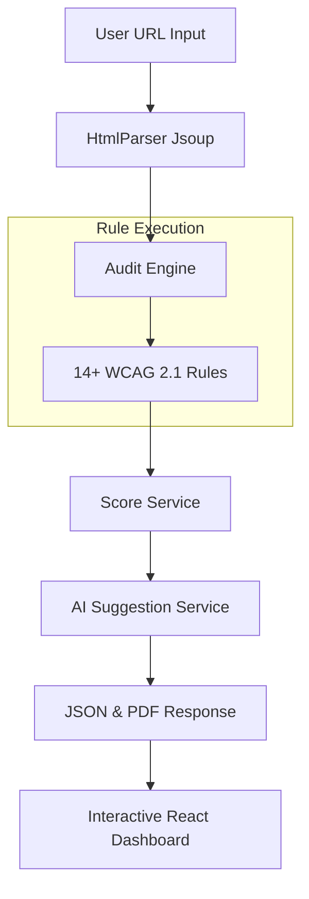

<div align="center">

<br/>

# 🌐 AuditAble

### Modern, Production-grade Web Accessibility Analyzer
*Ensuring inclusivity through automated audits and AI-powered intelligence.*

<br/>

[](https://www.oracle.com/java/)
[](https://spring.io/projects/spring-boot)
[](https://react.dev/)
[](https://vitejs.dev/)
[](https://ai.google.dev/)
[](LICENSE)

<br/>

*AuditAble crawls live websites, evaluates them against **WCAG 2.1 compliance rules**, generates weighted accessibility scores, and provides AI-driven fix suggestions with direct links to official documentation.*

<br/>

</div>

---

## 📸 Preview

> **Animated Gauge · Weighted Category Breakdown · WCAG-Linked Issue Cards · PDF Reporting**

AuditAble features a premium **Glassmorphism UI** with a live score gauge and color-coded severity levels. Each issue is tagged with its specific **WCAG Success Criterion** and includes a direct link to the official W3C documentation for maximum credibility.

---

## 🧠 How It Works



---

## ✨ Key Features

| Feature | Details |
|---|---|
| 🛡️ **14+ Smart Rules** | Comprehensive checks for Images, Forms, Links, Headings, Buttons, ARIA roles, and more. |
| 🔗 **WCAG 2.1 Mapping** | Every issue is mapped to official WCAG numbers with direct "Learn More" links. |
| 📊 **Weighted Normalization** | Scores are normalized 0–100 per category using specific severity weights for high accuracy. |
| 🤖 **Mixed Suggestion Engine** | Combines Google Gemini 1.5 Flash for complex fixes with robust static fallbacks. |
| 📄 **Exportable Reports** | Generate professional, styled PDF audits for offline review or client handoff. |
| 🧪 **In-built Test Suite** | Includes a dedicated `test-page.html` designed to trigger and verify every auditing rule. |
| 📐 **Extensible Architecture** | Modular rule system allowing developers to add custom checks in minutes. |

---

## ⚖️ Implemented Rules & WCAG Compliance

AuditAble covers the most critical accessibility barriers divided into four key categories:

### 🖼️ IMAGES — 25% weight
*   **[WCAG 1.1.1] Image Alt Missing**: Ensures meaningful images provide alternative text for screen readers.

### 🏗️ STRUCTURE — 30% weight
*   **[WCAG 2.4.2] Missing Title**: Checks for descriptive page titles.
*   **[WCAG 1.3.1, 2.4.6] Skipped Heading Level**: Ensures logical hierarchy (H1 → H2).
*   **[WCAG 4.1.2] ARIA Role Validation**: Validates WAI-ARIA roles against the specification.
*   **[WCAG 4.1.1] Duplicate ID**: Prevents the use of identical IDs which break assistive technology mappings.
*   **[WCAG 2.4.1, 1.3.1] Landmarks**: Verifies presence of `<header>`, `<nav>`, `<main>`, and `<footer>`.

### 📝 FORMS — 30% weight
*   **[WCAG 1.3.1, 3.3.2] Label Association**: Ensures inputs have programmatically associated labels.
*   **[WCAG 4.1.2] Button Accessibility**: Validates that buttons have discernible, accessible names.
*   **[WCAG 1.3.1, 3.3.2] Placeholder-Only**: Flags inputs that rely solely on placeholders (common antipattern).

### 🔗 LINKS — 15% weight
*   **[WCAG 2.4.4] Empty/Vague Link Text**: Flags "click here", "read more", and empty anchor tags that lack context.

---

## 📊 Scoring Methodology

AuditAble uses a two-stage weighted normalization formula:

1. **Category Score**: `max(0, 100 - Σ deductions)`
   - High Severity: `-15 pts`
   - Medium Severity: `-8 pts`
   - Low Severity: `-3 pts`

2. **Final Aggregate Score**:
   ```
   Final = (Structure × 0.3) + (Forms × 0.3) + (Images × 0.25) + (Links × 0.15)
   ```

---

## 🛠️ Tech Stack

- **Backend**: Java 21, Spring Boot 3.4
- **Parsing**: JSoup (for DOM traversal and live crawling)
- **AI Integration**: Google Gemini AI (Vertex AI/AI Studio)
- **PDF**: OpenPDF (LibrePDF)
- **Frontend**: React 19, Vite, Framer Motion, Lucide React
- **Styling**: Vanilla CSS (Modern Design System with CSS Variables)

---

## 🚀 Getting Started

### Prerequisites
- **JDK 21**
- **Node.js 18+**
- **Maven**

### 1. Installation
```bash
git clone https://github.com/garvsurve/AuditAble.git
cd AuditAble
```

### 2. Configuration
Create `src/main/resources/application-secrets.properties`:
```properties
gemini.api.key=YOUR_API_KEY
```

### 3. Run Application
**Start Backend:**
```bash
mvn spring-boot:run
```
*API running on `http://localhost:7070`*

**Start Frontend:**
```bash
cd frontend
npm install
npm run dev
```
*UI running on `http://localhost:5173`*

### 4. Local Testing
You can test the analyzer by pointing it at:
`http://localhost:7070/test-page.html`
*(This page is included in the project and contains intentional accessibility failures for testing purposes.)*

---

<div align="center">

Built with ❤️ by **Garv Surve**

*Making the web accessible, one scan at a time.*

</div>
